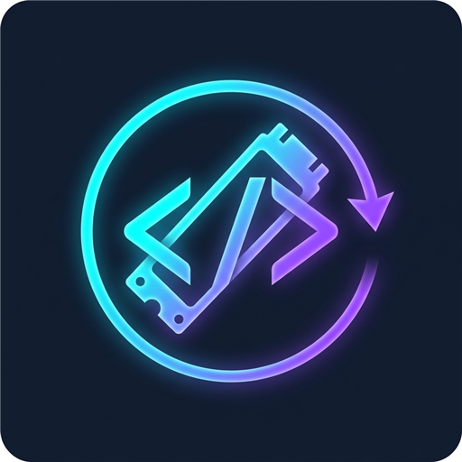

#  DevPurge 🚀
> **Ultra-fast developer disk reclaimer for disposable build caches and dependency folders.**

[](https://github.com/Behrad87/DevPurge/releases/latest)
[](LICENSE)
[](https://dotnet.microsoft.com/)
[](https://github.com/Behrad87/DevPurge/releases/latest)
[](https://github.com/sponsors/Behrad87)
[](https://ko-fi.com/behrad87)
[-00C853?logo=cashapp&logoColor=white)](https://reymit.ir/behrad87)

Developers frequently run out of SSD space due to dozens of forgotten repositories hoarding tens of gigabytes in build caches. General disk cleaners (WinDirStat, TreeSize) scan whole drives slowly and cannot distinguish between precious source code and disposable build artifacts.

**DevPurge** is built specifically for developers. It parallel-scans your workspaces to instantly locate, quantify, and batch-purge stale `node_modules`, `bin`/`obj`, Rust `target`, `.gradle`, and Python `.venv` directories in seconds.


<p align="center">
  
</p>

---

## ✨ Features

- ⚡ **Ultra-Fast Parallel Scanner**: Uses high-performance single-pass filesystem enumeration with instant tree pruning upon finding artifact boundaries, completing full multi-workspace scans in seconds.
- 🌳 **TreeSize Disk Analyzer**: Full-featured hierarchical disk space analyzer. Rapidly scans and visualizes entire directory trees with proportional visual bars, percentage breakdowns, file/folder counts, developer artifact tagging, and direct safe folder purging.
- 🛡️ **Hardened Safety & Resilience Rails**:
  - **Symlink & Junction Immunity**: Refuses to delete directory junctions, symbolic links, or reparse points, preventing external target loss.
  - **WSL & Virtual Mount Protection**: Protects WSL distro roots (`\\wsl$\Ubuntu`) and Linux system trees (`/bin`, `/etc`, `/usr`) while allowing user repos (`/home/user/...`).
  - **Cloud Sync Guard**: Protects OneDrive, Dropbox, and Google Drive sync roots and offline placeholder files from accidental deletion loops.
  - **Never** touches `.git` repositories, submodules, or worktrees.
  - **Protected System Blacklist**: Strict exclusions for `C:\Windows`, `Program Files`, `PerfLogs`, and Unix root structures (`/lib`, `/lib64`, `/opt`, `/root`, `/Volumes`).
  - **Manifest Safeguard**: Protects source code by aborting deletion if a directory contains project manifests (`package.json`, `Cargo.toml`, `.sln`, `.slnx`, `Dockerfile`, `go.mod`, `go.work`, `deno.lock`, `uv.lock`, `pdm.lock`, `pnpm-lock.yaml`, `requirements.txt`, `tsconfig.json`).
- 🔍 **Verified Dry-Run Simulation**: Inspects directory accessibility and active process file locks non-destructively before any purge.
- 📋 **Persistent Audit Logging**: Thread-safe audit records (`audit.jsonl`) tracking every purge action, user, timestamp, reclaimed bytes, and errors.
- 🗑️ **Recycle Bin or Permanent Deletion**: Safe deletion moves folders to the Windows Recycle Bin by default with automatic retry mechanisms for locked files.
- ⏳ **Granular Filtering**: Filter by age (`> 14 days`), size threshold (`--min-size 100MB`), ecosystem (`--type node`), or largest space-hoggers (`--top 10`).
- 📂 **Multi-Workspace Scanning**: Scan multiple developer repositories simultaneously by separating paths with `,` or `;`.
- 🎨 **Modern Windows 11 Fluent UI**: Clean dark theme, responsive grid, real-time folder & file counters, selection inversion (`Ctrl+Shift+I`), CSV/JSON/Markdown export (`Ctrl+Shift+E`), and File Explorer integration.
- 💻 **Headless CLI**: Streamlined for automation, cron jobs, and CI/CD pipelines with `NO_COLOR` and JSON output support.
- 🔒 **Privacy First**: 100% offline, zero telemetry, zero tracking.

---

## 📦 Supported Ecosystems & Targets

| Ecosystem | Target Directories |
| :--- | :--- |
| **JavaScript / TypeScript / Frameworks** | `node_modules`, `.next`, `.nuxt`, `.turbo`, `.cache`, `.svelte-kit`, `dist`, `.angular`, `.astro`, `.parcel-cache`, `.vite`, `.nx`, `.docusaurus`, `.rollup.cache`, `.swc`, `.rspack-cache`, `.nyc_output` |
| **.NET / C#** | `bin`, `obj`, `TestResults`, `BenchmarkDotNet.Artifacts` |
| **Rust / Cargo** | `target` |
| **Java / Kotlin / Android / Gradle** | `build`, `.gradle`, `.kotlin` |
| **Python** | `.venv`, `venv`, `__pycache__`, `.pytest_cache`, `.mypy_cache`, `.ruff_cache`, `.tox`, `htmlcov`, `.nox`, `.hypothesis`, `.uv_cache`, `.uv`, `.pixi`, `__pypackages__` |
| **PHP / Go** | `vendor`, `.gocache` |
| **Visual Studio / IDE Caches** | `.vs`, `.idea`, `.fleet`, `.bloop`, `.metals` |
| **Dart / Flutter** | `.dart_tool` |
| **C++ / CMake** | `cmake-build-debug`, `cmake-build-release`, `cmake-build-relwithdebinfo`, `cmake-build-minsizerel`, `.cxx` |
| **Zig** | `zig-cache`, `zig-out` |
| **Swift / Apple** | `DerivedData`, `.build` |
| **Elixir** | `_build` |
| **Ruby / Bundler** | `.bundle` |
| **Haskell** | `dist-newstyle`, `.stack-work` |
| **Terraform / OpenTofu** | `.terraform` |

## 📦 Downloads (v1.1.0)

Pre-built, **100% self-contained** standalone packages (zero runtime dependencies required):

| Platform | Interface | Package |
| :--- | :--- | :--- |
| **Windows (x64)** | **Setup Installer (Recommended)** | [⬇️ DevPurge-v1.1.0-windows-x64-installer.exe](https://github.com/Behrad87/DevPurge/releases/download/v1.1.0/DevPurge-v1.1.0-windows-x64-installer.exe) |
| **Windows (x64)** | Modern Fluent GUI (Portable) | [⬇️ DevPurge-v1.1.0-windows-x64-gui.zip](https://github.com/Behrad87/DevPurge/releases/download/v1.1.0/DevPurge-v1.1.0-windows-x64-gui.zip) |
| **Windows (x64)** | Headless CLI | [⬇️ DevPurge-v1.1.0-windows-x64-cli.zip](https://github.com/Behrad87/DevPurge/releases/download/v1.1.0/DevPurge-v1.1.0-windows-x64-cli.zip) |
| **Linux (x64)** | Headless CLI | [⬇️ DevPurge-v1.1.0-linux-x64-cli.tar.gz](https://github.com/Behrad87/DevPurge/releases/download/v1.1.0/DevPurge-v1.1.0-linux-x64-cli.tar.gz) |
| **Linux (ARM64)** | Headless CLI | [⬇️ DevPurge-v1.1.0-linux-arm64-cli.tar.gz](https://github.com/Behrad87/DevPurge/releases/download/v1.1.0/DevPurge-v1.1.0-linux-arm64-cli.tar.gz) |

👉 *Full release details and SHA-256 checksums available on the [Releases Page](https://github.com/Behrad87/DevPurge/releases/tag/v1.1.0).*

---

## 🖥️ Graphical Interface (WPF)

Launch `DevPurge.App`:
- **Workspace Navigation**: Switch seamlessly between **Artifact Cleaner** and the **TreeSize Analyzer** using the top navigation switcher.

### 🧹 Artifact Cleaner Tab
1. Pick one or more dev workspace folders (e.g. `C:\repos; D:\work`) or pick from your **History** dropdown.
2. Customize ecosystems or add custom folder patterns via **Rules...** manager.
3. Click **Scan Workspace**.
4. Inspect discovered folders, filter by ecosystem/age, toggle Project Cards or Table view, or invert selection (`Ctrl+Shift+I`).
5. Export reports to CSV or JSON with **Export...** (`Ctrl+Shift+E`).
6. Click **Purge Selected** to free gigabytes safely and immediately.

### 🌳 TreeSize Disk Analyzer Tab
1. Select any folder or drive path and click **Analyze Disk Hierarchy**.
2. Live KPI cards report **Total Directory Size**, **Total Folders**, **Total Files**, and the **Top Space Hogger**.
3. Explore the interactive tree with proportional percentage bars, file/folder metrics, and detected artifact tags (`node_modules`, `bin/obj`, `.venv`, etc.).
4. Real-time search filter instantly narrows the hierarchy to matching directory names.
5. Use **Expand All** or **Collapse All** for fast navigation.
6. Right-click or action buttons provide **Open in File Explorer**, **Copy Path**, and **Safe Purge to Recycle Bin** with confirmation.
7. Export tree hierarchy reports to **CSV**, **JSON**, or **Text Outline** formats.

<p align="center">
  
</p>

---

## ⌨️ Command Line Interface (CLI)

DevPurge includes a standalone CLI tool for power users:

```powershell
# Safe Dry-Run (preview how much space can be reclaimed across multiple paths)
DevPurge.Cli --path C:\repos,D:\repos

# 🌳 TreeSize Disk Analyzer (hierarchical tree breakdown with proportional visual bars)
DevPurge.Cli --path C:\repos --treesize

# Limit TreeSize display depth (e.g., up to 2 or 3 directory levels deep)
DevPurge.Cli --path C:\repos --treesize --depth 3

# Export TreeSize analysis to a formatted text outline or JSON
DevPurge.Cli --path C:\repos --treesize --depth 4 --export treesize-report.txt
DevPurge.Cli --path C:\repos --treesize --export treesize-report.json

# Purge folders untouched for more than 14 days
DevPurge.Cli --path C:\repos --clean --min-age 14

# Reclaim only heavy caches larger than 500MB
DevPurge.Cli --path C:\repos --clean --min-size 500MB

# Sort discovered folders by age, size, name, path, or files
DevPurge.Cli --path C:\repos --sort age

# Interactive selection before purging
DevPurge.Cli --path C:\repos --clean --interactive

# Purge only top 10 largest build artifact directories
DevPurge.Cli --path C:\repos --clean --top 10

# Clean only specific ecosystem artifacts (e.g. node, dotnet, rust, python)
DevPurge.Cli --path C:\repos --clean --type node

# Automated, non-interactive execution (skips prompt)
DevPurge.Cli --path C:\repos --clean --yes

# Exclude specific repositories or folders from scanning
DevPurge.Cli --path C:\repos --clean --exclude "legacy-app,temp-work"

# Permanent deletion (bypasses Windows Recycle Bin)
DevPurge.Cli --path C:\repos --clean --permanent

# Verify file locks and purge eligibility non-destructively
DevPurge.Cli --path C:\repos --verify

# View recent purge audit history
DevPurge.Cli --history

# Export scan report to CSV, JSON, or Markdown table
DevPurge.Cli --path C:\repos --export report.md

# Output structured JSON with dry-run verification
DevPurge.Cli --path C:\repos,D:\repos --json

# Silent execution with custom audit log destination
DevPurge.Cli --path C:\repos --clean --min-age 30 --silent --audit-log C:\logs\purge.jsonl
```

---

## 🏗️ Solution Architecture

```
DevPurge\
├── src\
│   ├── DevPurge.Core\           # Reusable engine (Models, FastScanner, SafetyValidator, PurgeService)
│   ├── DevPurge.App\            # Modern WPF Desktop UI (WPF-UI Fluent Dark Theme, MVVM)
│   └── DevPurge.Cli\            # Fast headless console runner
└── tests\
    └── DevPurge.Core.Tests\     # xUnit test suite (Safety validation, age calculation, byte formatting)
```

---

## 🛠️ Building from Source

Prerequisites: [.NET SDK](https://dotnet.microsoft.com/download) (8.0 or 10.0).

```powershell
# Clone the repository
git clone https://github.com/Behrad87/DevPurge.git
cd DevPurge

# Restore & Build
dotnet build -c Release

# Run tests
dotnet test tests/DevPurge.Core.Tests

# Run Desktop App
dotnet run --project src/DevPurge.App
```

---

## 💖 Support the Project & Donate

### 💡 The Value Trade-off
A fast 1TB NVMe SSD costs **~$80–$120**. High-end cloud storage or buying a secondary drive just to store abandoned `bin/obj` or duplicate `node_modules` caches is a waste of money. 

**DevPurge is 100% free, forever, with zero ads, zero paywalls, and zero telemetry.**

If DevPurge just reclaimed **20GB, 50GB, or 100GB** of your SSD and saved you hours of manual cleanup or delayed an expensive hardware purchase, please consider buying the developer a coffee. Your support funds continuous maintenance, new framework detectors, and keeps independent open source alive!

### 🌍 Ways to Support

| Platform | Best For | Link |
| :--- | :--- | :--- |
| **GitHub Sponsors** | Recurring or one-time international support | [💖 Sponsor @Behrad87](https://github.com/sponsors/Behrad87) |
| **Ko-fi** | Quick one-time coffee / tip via Card or PayPal | [☕ Buy Me a Coffee](https://ko-fi.com/behrad87) |
| **Reymit (Iran / ری‌میت)** | پرداخت ریالی و آنی از داخل ایران با کلیه کارت‌های عضو شتاب | [🇮🇷 حمایت از طریق ری‌میت](https://reymit.ir/behrad87) |

### ☕ Support Tiers & Perks

* **☕ A Cup of Coffee (\$3 / ۵۰,۰۰۰ تومان):** Say thanks for keeping your workspace tidy and SSD healthy.
* **🍕 A Slice of Pizza (\$10 / ۲۰۰,۰۰۰ تومان):** Fuels midnight debugging sessions and new ecosystem updates.
* **👑 Project Backer (\$25+ / ۵۰۰,۰۰۰ تومان):** Your name / company logo and link will be permanently immortalized in the **Wall of Supporters** below and in the app's *About* dialog!

---

## 🏆 Wall of Supporters

> A huge thank you to the generous developers and organizations who support DevPurge:

| Supporter | Tier | Note |
| :--- | :--- | :--- |
| *Your Name / Logo Here* | 🌟 Backer | [Be the first supporter!](https://github.com/sponsors/Behrad87) |

*(To get added here, sponsor via GitHub Sponsors, Ko-fi, or Reymit and include your GitHub username or display name in the message).*

---

## 🔒 Open Source Pledge

- **100% Offline:** DevPurge never sends your paths, files, or usage statistics over the internet.
- **No Paywalls:** Every feature (scanner, scheduler CLI, purge engine, GUI) is and will always remain completely free.
- **MIT License:** Freely inspect, modify, fork, and contribute.

---

## 📄 License

This project is licensed under the **MIT License** - see the [LICENSE](LICENSE) file for details.
